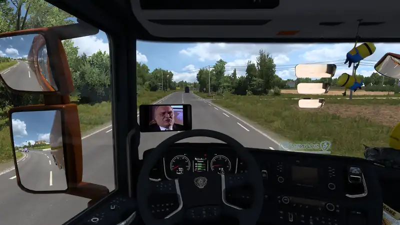
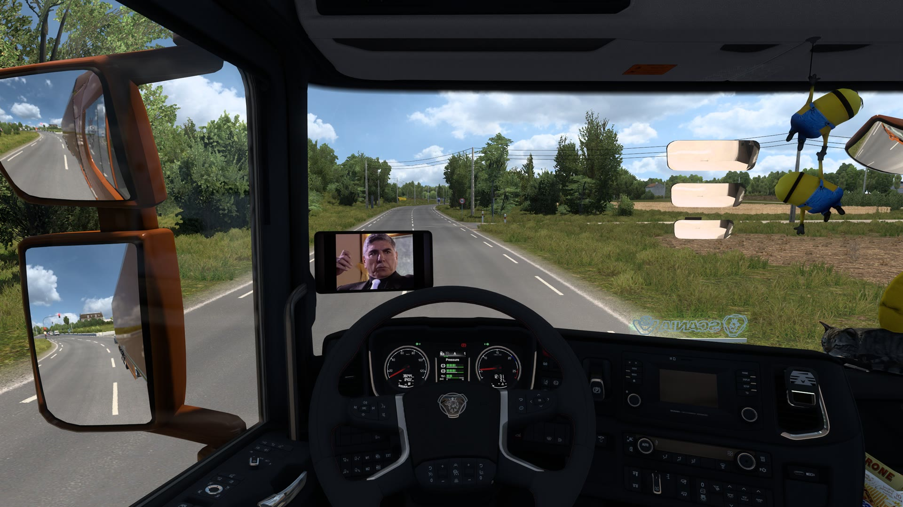
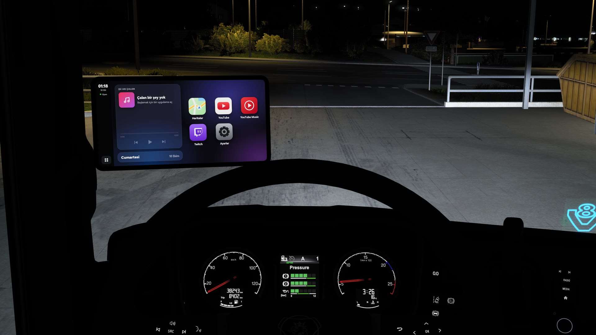
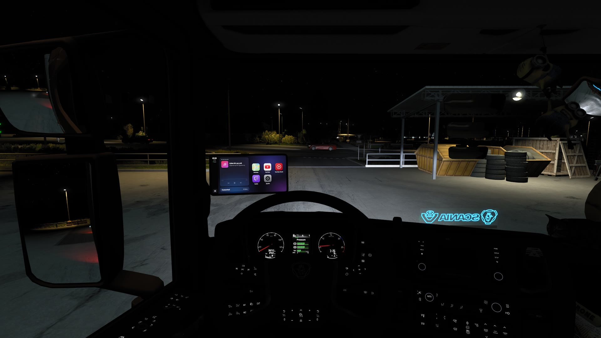
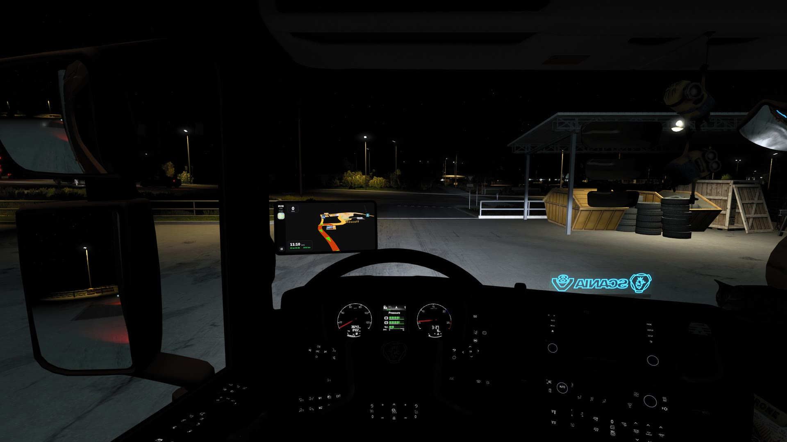
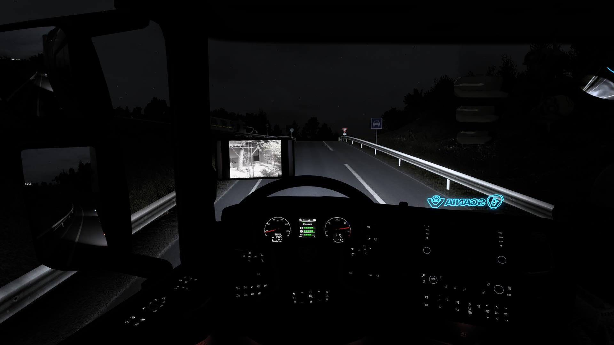

# CabinPlay

[English](README.md) · **Türkçe** · [Deutsch](README.de.md) · [Polski](README.pl.md) · [Français](README.fr.md) · [Español](README.es.md) · [Русский](README.ru.md)

**Euro Truck Simulator 2** için tır kabininde gerçekten çalışan bir medya ekranı. Sürerken ön cama takılı tablette YouTube izle, müzik dinle ve oyunun GPS haritasını takip et.

   
  ▶ <a href="https://github.com/timurmert/ets2-cabinplay/blob/main/docs/media/cabinplay-demo.mp4">Videonun tamamını sesli izle</a>

  
  

  
  
  

## İndir

**[Son sürümü indir](https://github.com/timurmert/ets2-cabinplay/releases/latest)**; `CabinPlay-x.y.z.zip` adlı dosyayı al.

## Kur

Oyunu kapat ve zip'i aç. Sonra birini seç:

**A) Otomatik.** **Install.cmd** dosyasına çift tıkla. Windows "kişisel bilgisayarınızı korudu" derse *Ek bilgi*, sonra *Yine de çalıştır* de (dosyalar imzalı değil). `Install.cmd` yalnızca `data\install.ps1` dosyasını çalıştırır; bu, açıp okuyabileceğin düz metin bir betiktir.

**B) Elle.** Hiçbir betik çalışmaz; `data` klasöründen üç şeyi kopyalarsın:

1. `cabinplay.scs` dosyasını `Belgeler\Euro Truck Simulator 2\mod` klasörüne
2. `plugin\cabinplay.dll` ve `plugin\cabinplay.ini` dosyalarını oyunun `bin\win_x64\plugins` klasörüne (`plugins` yoksa oluştur). Oyun klasörünü bulmak için: Steam'de oyuna sağ tıkla > *Yönet* > *Yerel dosyalara göz at*.
3. `app` klasörünü istediğin bir yere; sonra içindeki `CabinPlay.exe` dosyasını bir kez çalıştır. Sonrasında oyunla birlikte kendiliğinden açılır.

**Sonra, oyunda:**

1. Oyunu başlat ve bir kez çıkan "SDK özellikleri" uyarısını onayla.
2. **Mod Yöneticisi**'nde **CabinPlay Screen**'i etkinleştir.
3. Serviste, sol ön cam aksesuar yuvasına **CabinPlay Screen**'i tak. İki sürüm var: *Large* (11", kolda) ve *Compact* (10", camın dibinde).

Bu kadar. Ekran tırın kontağıyla birlikte açılır. Kaldırmak için **Uninstall.cmd** dosyasına çift tıkla ya da elle kopyaladığın dosyaları sil.

## Kullan

| Kısayol | Ne yapar |
|---|---|
| `Ctrl+Alt+C` | Ekranı oyunun içinden fare ve klavyeyle kullan; bu sırada oyun duraklar (çıkış: `Esc`) |
| `Ctrl+Alt+N` | Navigasyon haritası |
| `Ctrl+Alt+H` | Ana ekran |
| `Ctrl+Alt+Boşluk` | Oynat / duraklat |
| `Ctrl+Alt+→` `←` | Sonraki / önceki |
| `Ctrl+Alt+↑` `↓` | 10 saniye ileri / geri |
| `Ctrl+Alt+F` | Videoyu tam ekran yap |

Oyunu duraklattığında veya kontağı kapattığında çalan şey durur. Dil, ekrandaki **Ayarlar**'dan değişir.

## Gerekenler

- Euro Truck Simulator 2 **1.61**, Windows 10 veya 11
- DLC gerekmez
- Tek oyunculu: TruckersMP ile çalışmaz
- 25 tıra uyar; Renault E-Tech T'ye uymaz

## Yardım ve topluluk

Sorular, sorunlar ve duyurular için **[Discord sunucumuza katıl](https://discord.gg/rhGEbsu3zy)**.

Sorun bildirmek için ekrandaki **Ayarlar**'ı aç, **Hata raporu oluştur**'a bas ve masaüstüne kaydettiği zip'i paylaş.

**Video takılıyor ya da donuyor mu?** Oyun ekran kartının tamamını kullanıyordur. Oyunun grafik ayarlarında **Ölçekleme**'yi %200'e ya da altına indir (genelde neden %400'dür).

## İletişim

**İş birliği ve sponsorluk için:** **[contact@hydrabon.com](mailto:contact@hydrabon.com)** adresine yaz ya da bize [Discord](https://discord.gg/rhGEbsu3zy) üzerinden ulaş.

**Şikayet ve önerilerin için:** aynı adrese yaz ya da [Discord](https://discord.gg/rhGEbsu3zy) sunucumuzda bize ilet.

## Emeği geçenler ve lisans

Topluluk sunucumuz ve yazılım ekibimiz **HydRaboN** tarafından yapıldı. CabinPlay ücretsiz ve açık kaynaklıdır; [MIT lisansı](LICENSE) ile yayınlanır. İçinde [MinHook](https://github.com/TsudaKageyu/minhook) (BSD 2-Clause) kullanılır.

CabinPlay resmi olmayan bir hayran projesidir. SCS Software, Google/YouTube, Twitch veya Apple ile bağlantılı değildir ve onlar tarafından desteklenmez.
